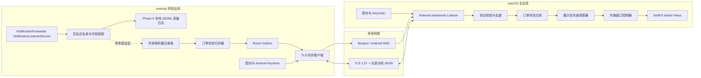
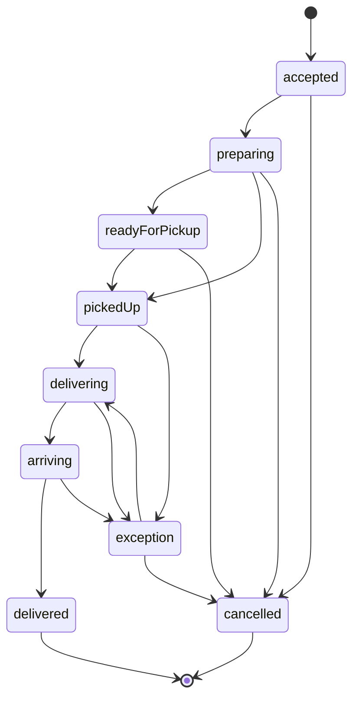
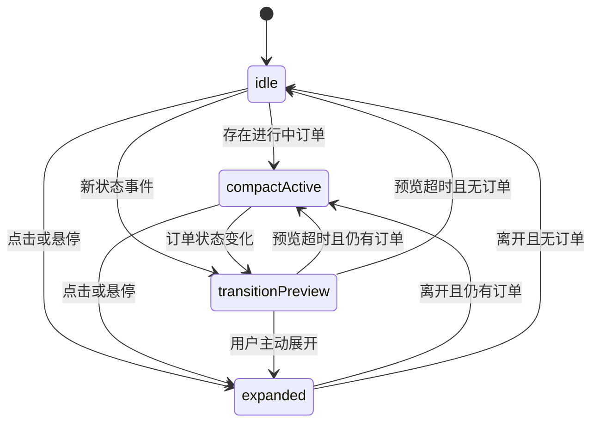

# MiPopup 项目设计文档

> 暂定名称：MiPopup  
> 文档状态：Implementation Draft v0.5  
> 更新日期：2026-07-15  
> 目标平台：macOS 14.6+、Android 8.0+（API 26+）
> 当前阶段：Phase 0，Android 采集真机通知样本；macOS 展示 AI 订阅额度与模型推荐

## 1. 项目摘要

MiPopup 是一套由 macOS 主应用和 Android 伴侣应用组成的跨设备通知系统。macOS 端在 MacBook 刘海区域提供类似“灵动岛”的常驻交互界面；Android 端读取用户授权的外卖通知，将美团外卖、淘宝闪购等应用的通知归一化为订单状态，再通过本地加密通道实时发送到 Mac。

产品的第一目标不是复制手机通知，而是把外卖订单转换为稳定、低打扰、可快速扫读的状态：

- 商家已接单
- 商家备餐中
- 骑手已取餐
- 配送中及预计送达时间
- 即将到达
- 已送达、已取消或发生异常

MVP 采用“本地优先”架构：通知内容默认只在 Android 手机上解析，Mac 只接收归一化后的最小字段；手机和 Mac 位于同一局域网时无需云服务。后续版本可增加端到端加密的云中继，以覆盖手机使用蜂窝网络、Mac 使用其他网络的场景。

当前不立即实现外卖文案解析。第一步基于 MIT 许可的 [NotificationForwarder](https://github.com/ItsAzni/NotificationForwarder) 构建 Android 采集版本，只监听用户选择的美团和淘宝闪购相关应用，把通知新增、更新和移除事件写入手机本地的结构化采集日志。用户完成真实订单采集并提供脱敏日志后，再根据实际字段实现解析器、订单状态机和 Mac 同步。

### 1.1 当前实施决策

- Android 基线：参考并改造 NotificationForwarder 的 `NotificationListenerService` 监听与去重流程，保留其 MIT 许可和版权声明。
- 当前交付：可安装的通知采集 APK、可编辑包名白名单、本地日志预览、脱敏导出和清除数据；可安装的 macOS 刘海应用、JSONL 拖拽/选择导入和原始通知摘要。
- 当前不做：外卖状态猜测、Android 到 Mac 的实时网络同步、云端上传和正式发行签名。
- 下一阶段输入：美团外卖和淘宝闪购至少各一笔完整订单的脱敏通知日志，推荐各两笔。
- 下一阶段输出：`MeituanNotificationParser`、`TaobaoInstantNotificationParser`、fixture 和解析准确率报告。

### 1.2 2026-07-15 实施快照

- Android 包名：`com.mipopup.capture`，最低 Android 8.0（API 26），目标 API 36。
- Android Manifest 不声明 `INTERNET`；Webhook、Room、WorkManager 和后台上传均已从采集构建移除。
- Android 原始 JSONL 位于应用私有目录，按天写入，保留 7 天且总量上限 20 MiB；导出使用 Storage Access Framework 并执行默认脱敏。
- Android 监听服务连接时会主动扫描当前 `activeNotifications`，采集器页面也提供手动扫描和匹配诊断，用于覆盖授权前已出现但仍活跃的 HyperOS 灵动岛通知。
- macOS 包名：`com.mipopup.macos`，最低 macOS 14；应用以 `LSUIElement` 方式运行，在菜单栏提供导入与退出入口。
- macOS 当前解析 `schemaVersion = 1` 的 JSONL，只展示事件计数、来源应用与最新通知，不产生配送状态结论。
- macOS 已接入 OpenAI Codex 与 Google Antigravity 的本机订阅额度 Provider；统一展示剩余百分比、额度周期、重置时间和订阅方案。
- Codex Provider 启动本机 `codex app-server`，调用 `account/rateLimits/read`；Antigravity Provider 优先探测正在运行的本地服务，必要时以 PTY 短暂启动 `agy`。
- Provider 每 3 分钟刷新，失败时保留最后一次成功快照；不采集账号邮箱、OAuth Token、API Key 或 API 账单数据。
- macOS 展开区新增“额度 / 模型推荐”Tab；模型页读取 Codex Radar 公开摘要，按最新实测 IQ 排序，并给出最强与均衡推荐。
- Codex Radar 数据每 30 分钟刷新，固定展示来源署名；公开摘要声明二次开发需要授权，因此当前仅用于本地开发测试，正式分发前必须取得站方授权/API Key。
- 当前构建为内部采样版本：Android 使用 debug 签名；macOS 应用使用 ad-hoc 签名，安装包未公证。

### 1.3 模型推荐规则与数据边界

模型推荐只使用 Codex Radar `current.json` 公开摘要中的最新 `model_iq` 数据，不读取用户账号、Codex 会话或提示词：

- “当前最强”：最新 IQ 指数最高的模型与 reasoning effort 组合；同分时优先测试成本较低者。
- “均衡推荐”：IQ 不低于最高分 90% 的组合中，选择测试成本最低者。
- UI 同时展示 IQ、固定任务集通过数和测试成本，避免把单一推荐包装成绝对结论。
- 推荐结果代表站点固定评测集的当前观测，不等同于所有项目和提示词下的实际效果。

Codex Radar 的公开摘要要求署名，并声明完整 API 与二次开发使用需要授权。MiPopup 固定展示“数据来自 Codex 雷达”及来源链接；当前实现仅用于本地验证，正式分发需替换为站方授权的接口和认证方式。

### 1.4 AI 订阅额度边界

AI 额度展示只覆盖订阅方案中可以由本机客户端读取的额度窗口：

- OpenAI：ChatGPT Plus/Pro 等方案中的 Codex/Agentic 使用窗口。
- Google：Google AI Pro/Ultra 迁移后的 Antigravity Gemini 模型额度；Claude/GPT 模型池暂不归入 Google 订阅卡片。
- 不覆盖：OpenAI API、Gemini API、按量账单，以及 ChatGPT/Gemini 网页端图片、语音、文件上传等独立限制。

Provider 的数据通道均为本地进程或回环地址。Codex app-server 仍属于实验协议，Antigravity language server 属于内部协议，因此解析模块必须保持隔离、容错，并以 fixture 覆盖字段变化。实现参考 [CodexBar](https://github.com/steipete/CodexBar) 的 MIT 许可 Provider 行为，许可文本保存在 `LICENSES/CodexBar-MIT.txt`。

## 2. 关键设计结论

1. **采用双端原生应用。** macOS 使用 Swift、SwiftUI 和 AppKit；Android 使用 Kotlin、Android 原生 View 和系统服务。原生实现更适合处理刘海窗口、系统通知、后台生命周期和低功耗长连接。
2. **MVP 通过 Android 通知获取外卖状态。** 不登录用户的外卖账号，不逆向美团或淘宝闪购私有接口，也不依赖无正式授权的第三方服务。
3. **Android 监听实现基于 NotificationForwarder。** 复用其 `NotificationListenerService`、包名过滤和内容去重思路；采集构建刻意移除 Room 队列、WorkManager、Webhook 和网络依赖，改为应用私有目录中的 JSONL 日志。
4. **先采集，后解析。** Phase 0 只记录真实通知字段，不用假设文案编写规则；拿到用户提供的脱敏日志后才冻结解析规则。
5. **外卖通知最终在 Android 端完成过滤和解析。** 默认不把完整通知文本传到 Mac，只发送商家简称、订单状态、ETA 等归一化字段。
6. **MVP 仅保证同局域网实时同步。** Mac 通过 Bonjour 发布服务，Android 通过 NSD 发现；双方完成一次扫码配对后建立 TLS 长连接。
7. **刘海界面由统一的展示调度器驱动。** 外卖、音乐、电池和系统事件不能分别直接控制窗口，必须经过优先级、去重、打断和自动收起规则。
8. **优先使用公开 API，私有窗口能力隔离为可替换适配器。** 公开 AppKit 窗口足以完成桌面和多数全屏场景；若要在锁屏等系统层级展示，可选接入 SkyLightWindow，但这会增加系统兼容和 Mac App Store 审核风险。

## 3. 项目目标与非目标

### 3.1 目标

- Android 外卖状态变化后，在同局域网正常条件下 1.5 秒内显示在 Mac 刘海区域。
- 支持无刘海外接显示器，以屏幕顶部居中的胶囊形态降级展示。
- 支持同时存在多个订单，并能优先展示最紧急的订单。
- 网络断开、App 重启或重复通知时不丢失最终状态，也不重复播放动画。
- 用户能明确知道 Android 通知权限、连接状态、正在同步哪些应用以及同步了哪些字段。
- 默认无云端、无广告 SDK、无行为分析 SDK，并提供完整的数据清除和设备解绑能力。

### 3.2 非目标

- 不替代外卖平台客户端，不提供下单、支付、退款或联系骑手功能。
- MVP 不从 Mac 远程操作 Android 外卖 App。
- 不保证从通知中获得精确的骑手 GPS 位置或地图轨迹。
- 不使用 OCR、无障碍服务或屏幕录制读取外卖 App 页面。
- 不把“通知消失”推断为“订单已送达”。
- MVP 不支持 iPhone；iOS 不向普通第三方应用开放等价的全局通知监听能力。

## 4. 可行性与边界

Android 的 `NotificationListenerService` 能在用户于系统设置中明确授权后，接收通知新增、更新和移除事件。它适合获取外卖 App 已经展示给用户的状态，但存在以下边界：

- 通知字段、渠道名称和文案可能随外卖 App 版本、语言、地区和 A/B 测试变化。
- 部分自定义通知可能只提供有限的标准文本字段。
- 工作资料、企业策略、低内存旧设备或厂商省电策略可能限制通知监听和后台连接。
- 通知被移除只表示通知不再活跃，不能作为业务终态。
- Play 商店发布时必须对通知数据的访问、传输、保留和用途做显著披露，并完成 Data safety 声明。

因此，系统应把通知解析器视为“可版本化的规则插件”，而不是写死在 UI 中。每个解析器都需要真实样本、置信度和回归测试。

## 5. 用户体验

### 5.1 当前阶段：通知样本采集

1. 用户安装 Phase 0 Android 采集 APK。
2. 应用展示本地采集说明，用户主动授予通知读取权限。
3. 应用预置美团外卖、美团、淘宝和饿了么/淘宝闪购候选包名；用户可按手机上的实际包名逐行修改并保存。
4. 授权后监听持续生效，只记录白名单包的通知，不把内容发送到网络。
5. 用户正常下单，并让采集覆盖接单、备餐、取餐、配送、即将到达、送达或取消等阶段；可随时回到应用刷新脱敏预览。
6. 订单结束后点击“导出脱敏 JSONL”，通过系统文件选择器保存文件。
7. 用户人工预览导出内容，确认不包含不希望分享的信息后，将文件提供给开发者。
8. 用户也可以在 macOS MiPopup 中导入或拖入 JSONL，确认事件数、来源和最新通知可读。
9. 开发者据此建立解析 fixture；Android App 更新后再进入解析准确率验证。

### 5.2 目标产品首次使用

1. 用户启动 Mac 应用，看到刘海基础界面和“连接 Android 手机”入口。
2. Mac 生成一次性二维码，同时通过 Bonjour 发布 `_mipopup._tcp` 服务。
3. 用户安装并打开 Android 伴侣应用，阅读显著的数据使用说明。
4. 用户进入系统设置，主动授予通知读取权限。
5. 用户选择允许同步的外卖应用；默认全部关闭，逐项开启。
6. Android 扫描 Mac 上的二维码，校验 Mac 证书指纹并发起配对。
7. Mac 显示手机名称和短验证码，用户确认后完成配对。
8. Android 发送测试事件，Mac 刘海播放一次预览动画。

### 5.3 目标产品日常流程

1. 外卖 App 发布或更新订单通知。
2. Android 伴侣应用仅处理用户白名单内的包名。
3. 解析器将通知转换为统一订单状态，并写入本地 Outbox。
4. 在线时立即发送到 Mac；Mac 返回 ACK 后删除 Outbox 中的对应事件。
5. Mac 合并订单状态，展示 4 至 8 秒的状态变化动画。
6. 动画收起后，存在进行中订单时保留紧凑图标和 ETA；无进行中订单时恢复默认刘海形态。
7. 用户悬停或点击刘海，可展开查看最多三个订单及手机连接状态。

### 5.4 断网与恢复

- 手机离线时，本地最多保存 200 条或 24 小时的归一化事件。
- Mac 重连后先请求 `order_snapshot`，再处理快照之后的新事件，避免回放过期动画。
- Android 合并同一订单的中间事件，只保留尚未确认的最新有效状态和终态。
- 连续 30 秒无法连接时，Mac 仅在展开视图显示灰色连接提示，不持续弹出提醒。

## 6. 总体架构



图中的实线 `NLS -> Filter -> Capture` 是当前 Phase 0 范围；解析、订单归并、跨设备传输和 macOS 展示在拿到真实样本后依次实现。

### 6.1 与 Notchly 的关系

[Notchly](https://github.com/Notchly/Notchly) 是 MIT 许可的 SwiftUI-first macOS 项目，其架构将 `AppDelegate`、长生命周期 Manager、顶层 Overlay Controller 和功能 View 分离。MiPopup 复用这一架构思想，但增加以下核心边界：

- 跨设备配对和加密传输
- 外卖领域模型与状态归并
- 可测试的通知解析插件
- 多事件优先级调度
- 连接与隐私状态 UI

若直接复制或修改 Notchly 源码，必须在发行包和源码中保留其 MIT 版权及许可文本。更推荐把刘海窗口、状态管理思想作为参考，在 MiPopup 中建立独立模块；需要锁屏 Overlay 时再通过适配器选择性接入 SkyLightWindow。

## 7. 技术栈

| 端 | 技术 | 用途 |
| --- | --- | --- |
| macOS | Swift 6、SwiftUI、AppKit | 应用、设置、刘海 UI 和窗口生命周期 |
| macOS | Network.framework、Bonjour | TLS 服务、设备发现和连接管理 |
| macOS | Keychain、CryptoKit | 配对凭据、密钥和消息摘要 |
| macOS | OSLog、Swift Testing/XCTest | 脱敏日志与测试 |
| Android | Kotlin、Coroutines、Flow | 业务逻辑和异步状态流 |
| Android | Jetpack Compose | 配对、权限、连接状态和设置 UI |
| Android | NotificationForwarder（MIT） | 监听、包名过滤、突发去重、Room/WorkManager 基线 |
| Android | NotificationListenerService | 获取用户授权的通知新增、更新和移除事件 |
| Android | Room、应用私有 JSONL | Phase 0 采集会话、摘要和后续 Outbox |
| Android | WorkManager | 后续恢复同步和受约束后台任务；Phase 0 不上传日志 |
| Android | Android Keystore、JSSE | 凭据保护和 TLS 客户端 |
| 共享 | JSON Schema fixtures | 协议契约和跨端兼容测试 |

MVP 不引入跨平台 UI 框架，也不引入云数据库、消息队列或 AI 文案解析服务。

## 8. 建议目录结构

```text
mi_popup/
├── apps/
│   ├── macos/
│   │   ├── MiPopup.xcodeproj
│   │   ├── MiPopup/
│   │   │   ├── App/
│   │   │   ├── Domain/Orders/
│   │   │   ├── Managers/
│   │   │   ├── Networking/
│   │   │   ├── Security/
│   │   │   ├── Windows/
│   │   │   ├── Views/Island/
│   │   │   ├── Views/Settings/
│   │   │   └── Resources/
│   │   └── MiPopupTests/
│   └── android/
│       ├── app/
│       │   └── src/
│       │       ├── main/java/.../
│       │       │   ├── notification/
│       │       │   ├── capture/
│       │       │   ├── parser/
│       │       │   ├── order/
│       │       │   ├── pairing/
│       │       │   ├── sync/
│       │       │   └── ui/
│       │       └── test/resources/fixtures/
│       └── build.gradle.kts
├── protocol/
│   ├── schemas/
│   ├── examples/
│   └── PROTOCOL.md
├── docs/
│   ├── PRIVACY.md
│   ├── PARSER_GUIDE.md
│   └── TEST_PLAN.md
├── LICENSES/
│   └── NotificationForwarder-MIT.txt
└── PROJECT_DESIGN.md
```

## 9. Android 端设计

### 9.1 NotificationForwarder 实施基线

Android 端以 `ItsAzni/NotificationForwarder` 为代码基线，而不是重新从空项目实现通知监听。可直接复用：

- `AppNotificationListenerService` 的通知回调和 500 ms 突发重复抑制。
- 包名白名单/黑名单和用户设置页面。
- Room 数据库、队列状态和容量观察能力。
- WorkManager 的网络约束、退避重试和重启调度框架。
- Kotlin、Coroutines 和 Compose 工程结构。

在进入真机采集前必须完成以下定向改造：

1. 将项目品牌、applicationId 和命名空间改为 MiPopup Android Companion。
2. 保留 NotificationForwarder MIT 许可文本，并在 `LICENSES/` 和应用“关于”页面标注来源。
3. 按 Android 当前官方示例复核监听 Service；基线项目当前使用 `android:exported="true"`，MiPopup 计划改为 `false` 并完成真机绑定验证。
4. 将 `android:allowBackup` 设为 `false`，同时在 backup/data-extraction rules 中显式排除采集数据库和日志。
5. 扩充字段提取，不再只保存 title/text；增加 bigText、subText、textLines、channelId、progress、category 和 extras key 列表。
6. 新增 Capture Mode。Phase 0 禁用自定义 Webhook 和任何通知内容上传，只写入应用私有存储。
7. 新增会话化日志、滚动清理、内容预览、默认脱敏导出和一键删除。
8. Release 构建默认关闭原始采集入口；研究构建通过显式开关启用。

### 9.2 模块职责

| 模块 | 职责 | 不负责 |
| --- | --- | --- |
| `PermissionCoordinator` | 检查通知读取、通知显示和网络相关权限；引导进入系统设置 | 代替用户授权 |
| `AppNotificationListenerService` | 复用 NotificationForwarder，接收 posted、updated、removed | 解析外卖语义或直接控制 UI |
| `PackageAllowlist` | 仅允许用户开启的包名进入解析链 | 猜测未安装应用 |
| `NotificationExtractor` | 提取 title、text、bigText、subText、progress、channelId、key、postTime | 解析外卖业务语义 |
| `CaptureSessionManager` | 创建/停止采集会话，生成 session salt 和 sequence | 写日志和做内容解析 |
| `CaptureLogStore` | 把结构化事件写入应用私有 JSONL，执行滚动和过期清理 | 上传通知内容 |
| `CaptureExportService` | 生成摘要、自动脱敏、预览和用户主动导出 | 后台自动分享文件 |
| `ParserRegistry`（Phase 1） | 按包名和规则版本选择解析器 | 保存订单状态 |
| `OrderReducer`（Phase 1） | 去重、校验状态前进、合并 ETA 与订单字段 | 处理传输重试 |
| `OutboxRepository`（Phase 2） | 持久化待发送事件、ACK 删除、容量和过期清理 | 长连接生命周期 |
| `PairingManager`（Phase 2） | 扫码、指纹校验、设备授权和 Keystore 凭据 | 解析通知 |
| `SyncClient`（Phase 2） | NSD 发现、TLS 连接、握手、心跳、ACK 和重连 | 决定展示优先级 |

### 9.3 目标应用与包名选择

预置候选包名仅用于帮助用户定位，不能作为唯一事实来源：

| 应用入口 | 候选包名 |
| --- | --- |
| 美团外卖独立 App | `com.sankuai.meituan.takeoutnew` |
| 美团主 App 中的外卖入口 | `com.sankuai.meituan` |
| 淘宝闪购独立 App（原饿了么） | `me.ele` |
| 淘宝主 App 中的闪购入口 | `com.taobao.taobao` |

采集 UI 必须展示手机上实际安装的应用名称、图标和包名，由用户勾选。日志以 `StatusBarNotification.packageName` 为准。Phase 0 默认只允许上述候选中被用户选中的包进入 CaptureLogStore，其余通知不读取正文、不持久化。

### 9.4 通知字段提取

优先读取 Android 标准字段：

- `Notification.EXTRA_TITLE`
- `Notification.EXTRA_TEXT`
- `Notification.EXTRA_BIG_TEXT`
- `Notification.EXTRA_SUB_TEXT`
- `Notification.EXTRA_INFO_TEXT`
- `Notification.EXTRA_PROGRESS`、`EXTRA_PROGRESS_MAX`、`EXTRA_PROGRESS_INDETERMINATE`
- `StatusBarNotification.key`、`groupKey`、`postTime`、包名和 channelId

提取层只产生 `RawNotificationSnapshot`，不得包含平台业务规则。默认不读取通知的图片、头像或 RemoteViews。

另外记录不含可执行对象的诊断字段：

- `eventType`：`posted`、`updated`、`removed`、`listener_connected`、`listener_disconnected` 或 `user_marker`。Android 的通知更新仍通过 `onNotificationPosted` 回调进入；同一哈希 key 首次出现记为 posted，后续内容发生变化记为 updated。
- App 版本名/版本号、Android 版本、设备厂商和机型。
- `Notification.when`、category、flags、是否 group summary、是否 ongoing，以及移除回调可获得时的 reason。
- extras 中存在的 key 名称，但未知类型的值不做通用序列化。
- notification key、group key、tag 和可能含业务 ID 的字段只保存会话盐哈希，用于关联更新，不直接导出原值。
- 不读取或执行 `PendingIntent`，不导出通知 actions、图片、头像、RemoteViews 和声音 URI。

### 9.5 Phase 0 结构化采集日志

完整通知内容可能包含地址、姓名、手机号和订单号，因此“日志”特指应用私有目录中的结构化 JSONL 文件，不是 Logcat：

- Logcat 只记录 sessionId、包名、事件计数和错误码，不输出 title/text/bigText。
- 原始 JSONL 保存于应用私有存储，其他普通 App 无法读取。
- 每个采集会话使用独立随机 salt 对 key、groupKey、tag 做 SHA-256，以保留同一会话内的相等关系。
- 单会话上限 20 MiB，单文件上限 5 MiB；达到上限后停止正文采集并明确提示，不静默覆盖当前会话。
- 原始会话默认保留 7 天，用户可以立即删除；卸载应用会一并删除。
- 原始日志不进入 Android 系统备份、云备份、Webhook、分析 SDK 或崩溃报告。

单条本地记录示例：

```json
{
  "schemaVersion": 1,
  "sessionId": "capture-7b91e1",
  "sequence": 42,
  "capturedAt": "2026-07-14T12:30:45.281Z",
  "eventType": "posted",
  "source": {
    "packageName": "me.ele",
    "appVersionName": "example",
    "channelId": "example_channel"
  },
  "identity": {
    "notificationKeyHash": "sha256:...",
    "groupKeyHash": "sha256:...",
    "isGroupSummary": false
  },
  "content": {
    "title": "示例商家",
    "text": "骑手正在配送，请注意接听电话",
    "bigText": null,
    "subText": null,
    "textLines": []
  },
  "progress": {
    "value": null,
    "max": null,
    "indeterminate": false
  },
  "extrasKeys": ["android.title", "android.text"]
}
```

同一个 `notificationKeyHash` 再次出现时仍记录新行，因为通知更新序列正是解析配送状态所需的核心样本。仅过滤完全相同内容在极短时间内的重复回调，并在摘要中累计 `suppressedDuplicateCount`。

### 9.6 导出与用户交付流程

停止采集后生成两个文件：

- `capture-summary.json`：App/系统版本、时间范围、包名、事件数、字段覆盖率和重复计数，不含通知正文。
- `capture-<session>-redacted.jsonl`：默认分享文件，对手机号、连续长数字、疑似订单号和明显地址片段做占位替换，同时保留状态文案和字段结构。

导出前必须在 App 内预览。自动脱敏不能保证识别所有中文姓名和地址，因此 UI 要明确提醒用户人工检查。若脱敏破坏了必要语义，可提供“原始导出”，但必须二次确认，且仍然只能通过系统分享面板由用户主动操作。应用本身不配置日志上传服务器。

推荐采集集：

- 美团外卖和淘宝闪购各至少一笔完整订单，最好各两笔。
- 覆盖接单、备餐、取餐、配送、即将到达、送达；条件允许时增加取消或配送异常。
- 至少保留一条营销/红包/聊天类非订单通知作为负样本。
- 如果在淘宝主 App 下单，同时保留 `com.taobao.taobao` 和 `me.ele` 的相关事件，以确认真正通知来源。

用户提供脱敏 JSONL 后，开发者先把它转换成版本化 fixture，再编写解析器；不得直接对单条样本文案写不可回归的临时判断。

### 9.7 解析器接口（Phase 1）

每个外卖平台实现一个纯函数式解析器：

```kotlin
interface FoodNotificationParser {
    val parserId: String
    val parserVersion: Int
    fun supports(snapshot: RawNotificationSnapshot): Boolean
    fun parse(snapshot: RawNotificationSnapshot): ParseResult
}
```

`ParseResult` 包含：

- `Matched(update, confidence)`：成功识别，置信度为 0 到 1。
- `Ignored(reason)`：属于白名单应用，但不是订单状态通知。
- `Unknown(sanitizedFingerprint)`：疑似订单通知但当前规则无法识别。

解析器在收到用户采集日志前保持未实现。Phase 1 使用确定性的字符串规则、正则和字段映射，不使用大模型。理由是规则可以离线运行、可回归、延迟稳定且不会上传通知文本。

### 9.8 样本门禁与回归机制

开发版本提供“本地导出脱敏样本”功能，且必须由用户主动触发。脱敏策略：

- 姓名、手机号、门牌号、订单号替换为占位符。
- 商家名可选择保留或哈希。
- 删除通知图片和 PendingIntent。
- 导出前在设备上向用户展示最终文本。

每个平台解析器至少覆盖以下 fixture：接单、备餐、取餐、配送、即将到达、送达、取消、异常、营销通知和重复更新。解析规则修改必须跑完整 fixture 回归。

进入 Phase 1 的门禁：

- 两个目标 App 的实际通知来源包名已确认。
- 每个 App 至少有一笔从接单到终态的完整会话。
- posted/updated/removed 事件顺序可以按哈希 key 关联。
- 导出文件已由用户确认可用于开发，并完成脱敏检查。
- 对缺失状态、字段变化和样本不足有明确记录，不用猜测补齐。

### 9.9 订单状态机（Phase 1）



状态枚举：

```text
unknown
accepted
preparing
ready_for_pickup
picked_up
delivering
arriving
delivered
cancelled
exception
```

归并规则：

- 相同 `orderKey` 的状态默认只能向前推进。
- `exception` 可恢复到配送状态；`delivered` 和 `cancelled` 是终态。
- ETA 允许增加或减少，不受状态单调性约束。
- 低置信度结果不覆盖高置信度状态，只更新原始事件指纹用于诊断。
- `onNotificationRemoved` 只记录通知生命周期，不改变订单业务状态。
- 无法得到平台订单号时，使用包名、稳定通知 key、分组 key 和时间窗口生成本地订单键；键值不可逆哈希后再传输。

### 9.10 实时与省电模式（Phase 2）

提供两种显式模式：

- **实时模式（默认推荐）：** 用户从可见页面启动前台同步服务，Android 常驻一条明确通知并维护 TLS 连接。适合低延迟，但有持续通知和额外耗电。
- **省电模式：** 不维持常驻连接；新事件写入 Outbox 后尝试短连接，并由 WorkManager 补偿。系统可能延迟调度，因此不承诺秒级送达。

Android 12+ 对后台启动前台服务有限制。实现时不得假设任意通知回调都能无条件拉起前台服务；实时模式应由用户主动开启，并在系统终止后通过清晰状态提示恢复。

## 10. 传输、配对与协议

### 10.1 服务发现

- Mac 通过 Network.framework/Bonjour 发布 `_mipopup._tcp`。
- Android 通过 `NsdManager` 查找同类型服务。
- 服务名只包含用户设置的 Mac 昵称和随机实例后缀，不广播用户名、手机号或订单信息。
- NSD 失败时，扫码内容可携带当前局域网地址作为一次性回退；同时允许用户手工输入地址。

### 10.2 配对流程

1. Mac 首次运行时生成并在 Keychain 保存本机 TLS identity；每次配对只生成新的 256 位随机 secret 和临时会话 ID。
2. 二维码包含协议版本、服务实例 ID、secret 和 Mac 证书 SHA-256 指纹；有效期 2 分钟，只能使用一次。
3. Android 发现服务后连接，并校验二维码中的证书指纹，防止局域网中间人攻击。
4. Android 发送设备名称和自己的公钥；Mac 要求用户确认设备和短验证码。
5. Android 在 Keystore 生成不可导出的 P-256 设备密钥并发送公钥；Mac 保存受信任公钥并签发随机设备 ID。
6. 后续连接固定 Mac 证书，并使用随机 challenge 和 Android 设备私钥签名完成应用层双向认证。解绑时删除双方凭据，并将设备 ID 加入本地撤销列表。

不建议只使用 6 位配对码作为密钥。若提供手工码模式，必须增加 Mac 端确认、尝试次数限制和短有效期。

### 10.3 连接协议

MVP 使用 TLS TCP 长连接，优先协商 TLS 1.3；为兼容 Android 8/9，最低允许 TLS 1.2，并只启用带前向保密能力的现代 AEAD cipher suite。应用层采用 4 字节大端长度 + UTF-8 JSON。单帧最大 16 KiB，超限立即断开，避免内存攻击。

握手消息声明：

- `protocolMin`、`protocolMax`
- `deviceId`
- `appVersion`
- `lastAckedSequence`
- 支持的 capability，例如 `order_snapshot_v1`

可靠性规则：

- 每个设备维护单调递增的 `sequence`。
- 每个事件包含全局唯一 `eventId`；Mac 按 `(deviceId, eventId)` 去重。
- Mac 对处理成功的事件返回累计 ACK。
- 顺序判断以 sequence 为主，不依赖手机和 Mac 的系统时间一致。
- 心跳间隔 20 秒；连续两个心跳无响应则重连。
- 重连使用指数退避并加入随机抖动，前台最大退避 30 秒。
- 协议版本无交集时停止重试，并显示“需要升级应用”。

### 10.4 事件示例

```json
{
  "schemaVersion": 1,
  "type": "order_update",
  "eventId": "9a319e86-a8eb-4d92-9894-4a9f70c314d3",
  "deviceId": "android-7c33992d",
  "sequence": 184,
  "sentAt": "2026-07-14T11:42:17Z",
  "expiresAt": "2026-07-15T11:42:17Z",
  "payload": {
    "orderKey": "sha256:4d7b...",
    "provider": "provider_a",
    "state": "delivering",
    "merchantDisplayName": "汉堡店",
    "etaMinutes": 12,
    "statusText": "骑手正在配送",
    "confidence": 0.96,
    "parserVersion": 3
  }
}
```

协议中不传递原始通知全文、收货地址、完整订单号、手机号、通知图片或可执行 PendingIntent。

### 10.5 异地网络扩展

后续版本可增加可选云中继：Android 和 Mac 都与中继建立出站连接，中继仅保存端到端加密后的短期消息。密钥只能由已配对设备持有。此能力需要独立的隐私评审、账号/设备恢复方案、服务器运维和滥用防护，不属于 MVP。

## 11. macOS 端设计

### 11.1 应用层

- `MiPopupApp`：SwiftUI 入口。
- `AppDelegate`：只负责应用启动、终止和 activation policy。
- `AppEnvironment`：创建并持有 Manager、Store、窗口和网络服务。
- `MenuBarController`：菜单栏图标、连接状态、设置和退出。
- `SettingsWindowController`：配对设备、显示器、隐私、动画和调试设置。

### 11.2 领域与状态层

- `PairingManager`：配对会话、受信任设备和 Keychain。
- `DeviceConnectionManager`：Bonjour listener、会话、心跳和在线状态。
- `OrderEventDecoder`：schema 校验、大小限制、版本兼容和去重。
- `OrderStore`：当前订单快照、终态保留和可选的脱敏历史。
- `IslandPresentationCoordinator`：跨模块优先级、预览时长、打断和恢复。
- `SettingsManager`：UserDefaults、登录启动和显示偏好。

所有系统 API 和网络回调先进入 Manager/Store，再向 SwiftUI 发布只读状态。View 不直接打开 Socket，也不自行合并订单事件。

### 11.3 窗口层

定义统一协议以隔离公开和私有窗口实现：

```swift
@MainActor
protocol IslandWindowProviding {
    func show(on screen: NSScreen)
    func update(frame: CGRect, interactive: Bool)
    func hide()
}
```

默认 `AppKitIslandWindowProvider` 使用无边框、透明、非激活 `NSPanel`，并配置跨 Space 和全屏辅助行为。窗口不抢键盘焦点；只有用户点击展开内容时才启用必要的命中测试。

刘海几何位置优先根据 `NSScreen.safeAreaInsets` 及顶部辅助区域计算，不用固定像素猜测。若屏幕没有刘海，则渲染顶部居中胶囊。屏幕切换后延迟约 250 ms 重新计算，避免系统参数更新过程中的抖动。

可选 `SkyLightIslandWindowProvider` 只用于确实需要锁屏或更高系统层级的直接分发版本。该模块不能渗透到订单、网络和 View 层，并且必须能通过编译开关完全移除。

### 11.4 刘海展示状态机



展示形态：

- `idle`：黑色刘海背景，不显示业务信息。
- `compactActive`：左侧平台/状态图标，右侧 ETA 或关键状态；宽度只比刘海略大。
- `transitionPreview`：展开为单行或双行状态卡，4 至 8 秒自动收起。
- `expanded`：显示最多三个进行中订单、连接状态和最近一次更新时间。
- `connectionWarning`：仅作为 expanded 内的辅助状态，不单独抢占刘海。

### 11.5 多模块优先级

所有功能生成 `PresentationRequest`，由 Coordinator 统一排序：

| 事件 | 基础优先级 | 默认预览 |
| --- | ---: | ---: |
| 外卖取消、异常、即将到达 | 100 | 8 秒 |
| ETA 小于等于 5 分钟 | 95 | 6 秒 |
| 骑手已取餐、开始配送 | 85 | 6 秒 |
| 商家接单、备餐 | 70 | 5 秒 |
| 外卖已送达 | 65 | 6 秒 |
| Agent 需要用户授权 | 90 | 持续到处理 |
| 音乐切歌预览 | 40 | 3 秒 |
| 音量、亮度、电池变化 | 30 | 2 秒 |

调度规则：

- 用户主动展开的内容优先于自动预览，除非出现取消、异常或即将到达。
- 同一订单 2 秒内的多次更新合并为最终状态。
- 高优先级事件可以打断低优先级预览；被打断内容不重复从头播放。
- 同优先级按接收顺序展示，但等待超过 10 秒的过时中间状态直接丢弃。
- 音乐可以在外卖事件预览结束后恢复，不允许多个 View 同时修改岛的尺寸。

### 11.6 UI 视觉规范

- 背景以接近纯黑为主，与实体刘海融合；内容使用克制的高对比文字。
- 状态颜色只作辅助：备餐为暖黄、配送为蓝、即将到达为橙、送达为绿、异常为红。
- 不仅依赖颜色表达状态，必须同时显示图标或文字。
- 紧凑态只显示一项关键信息；长商家名自动截断，不滚动干扰用户。
- 展开态推荐宽 340 至 380 pt，单订单高约 88 至 112 pt；最终尺寸由安全区域和字体测量决定。
- 动画优先使用弹性宽高变化和轻量淡入；支持“减少动态效果”。
- 支持 VoiceOver、键盘退出展开、动态字体可读性和高对比度。

## 12. 数据与隐私

### 12.1 数据最小化

Phase 0 采集路径：

```text
Android 通知
  -> 用户选择的包名白名单
  -> 应用私有原始 JSONL（最长 7 天）
  -> 用户主动停止采集
  -> 本机自动脱敏 + 用户预览
  -> 用户主动分享脱敏文件
```

目标产品数据路径：

```text
Android 通知
  -> 手机端白名单过滤
  -> 手机端规则解析
  -> 丢弃原始通知
  -> 发送归一化字段
  -> Mac 内存态订单仓库
```

- Phase 0 的完整正文只允许出现在应用私有采集文件中；Logcat、崩溃报告和网络请求均不得包含正文。
- Phase 0 capture 构建不声明 `INTERNET` 权限，从系统能力层面阻止应用上传采集内容。
- Android Outbox 只保存归一化事件，ACK 后删除。
- Mac 默认仅保存当前订单和最近 24 小时的脱敏状态；用户可以关闭历史，关闭后只保存在内存。
- Phase 1 之后的生产日志不记录通知全文、地址、手机号、订单号、二维码 secret、TLS 密钥或证书私钥。
- 崩溃报告默认关闭；若后续引入，必须在上传前再次脱敏并征得用户选择同意。
- 提供“删除本机数据”“解绑并删除设备凭据”“导出我的数据”。

### 12.2 威胁模型

| 威胁 | 防护 |
| --- | --- |
| 同局域网窃听 | TLS 1.3 优先，Android 8/9 最低 TLS 1.2 + AEAD |
| 局域网中间人 | 二维码固定证书指纹 + Mac 端确认 |
| 未授权手机连接 | 一次性 secret、短有效期、受信任设备列表 |
| 事件伪造或重放 | 双向设备认证、sequence、eventId、过期时间 |
| 超大或恶意帧 | 16 KiB 上限、严格 schema、未知字段容忍但不执行 |
| Mac 被盗后读取凭据 | Keychain；敏感设置不放 UserDefaults |
| Android 备份泄露密钥 | Keystore 非导出密钥；敏感凭据禁止云备份 |
| Phase 0 日志泄露个人信息 | 应用私有存储、capture flavor 无 INTERNET、禁用备份、7 天清理、默认脱敏导出和人工预览 |
| 生产日志泄露个人信息 | 不记录正文、结构化脱敏日志、release 日志级别收紧 |

## 13. 权限与分发

### 13.1 Android

必要能力预计包括：

- 通知读取特殊授权：`BIND_NOTIFICATION_LISTENER_SERVICE` 由系统绑定，用户在设置中开启。
- Phase 0 capture flavor 不声明 `INTERNET`，不启用 NotificationForwarder 原有 Webhook。
- Phase 2 sync flavor 才增加网络访问与网络状态。
- Android 13+ 显示实时同步前台服务通知所需的通知权限在 Phase 2 添加。
- 启动实时模式所需的前台服务声明在 Phase 2 添加，具体 service type 按发布时 Android 要求复核。

应用必须在跳转系统授权页之前展示显著说明：读取哪些通知、为何读取、发送哪些字段、发送到哪里、保存多久以及如何撤销。

### 13.2 macOS

- 本地网络和 Bonjour 服务说明。
- 网络 server/client entitlement，具体取决于是否启用 App Sandbox。
- 使用 `SMAppService` 实现可选登录启动。
- 若只实现外卖功能，不需要 Automation、辅助功能、屏幕录制或通知读取权限。

### 13.3 发布策略

MVP 建议：

- macOS：Developer ID 签名、Hardened Runtime、公证后的 DMG，使用 Sparkle 或手工更新。
- Android：先使用签名 APK 或 Play Internal Testing 收集真实设备兼容性数据，再评估公开上架。

若使用私有 MediaRemote、SkyLight 或其他非公开系统 API，应默认按“官网直接分发”规划，并接受 macOS 更新导致功能失效的风险。若以 Mac App Store 为目标，则应只保留公开 AppKit 窗口能力，并单独进行沙盒和审核验证。

## 14. 可靠性与失败恢复

| 场景 | 处理方式 |
| --- | --- |
| 通知权限被撤销 | Android 立即停止采集，在首页和前台服务通知中显示状态；不循环弹窗 |
| Listener 断开 | 等待系统回调并调用受支持的 rebind 流程；记录脱敏诊断状态 |
| Mac 不在线 | 写入 Outbox，按订单合并，恢复后发送快照 |
| Bonjour 发现失败 | 重试、扫码地址回退、手工地址和网络诊断页 |
| TLS 凭据失效 | 停止自动重试并要求重新配对，不降级为明文 |
| 重复或乱序消息 | eventId 去重、sequence 排序、状态机拒绝倒退 |
| 两端时间不一致 | 顺序使用 sequence；时间仅用于 UI 和过期提示 |
| 外卖文案变化 | 返回 Unknown，保持上一可信状态；解析器 fixture 迭代 |
| 多个订单同时更新 | 按紧急度展示，展开态并列，终态短暂保留 |
| Mac 屏幕切换 | 重新选择目标屏幕并计算刘海几何，原状态不丢失 |
| 全屏 App | 遵循用户设置：隐藏、保持紧凑或允许重要外卖事件短暂出现 |
| 旧客户端协议 | capability 协商；不兼容时明确提示升级 |

## 15. 性能目标

以下指标作为验收目标，而非未经测量的承诺：

- 同局域网事件端到端延迟：P50 小于 300 ms，P95 小于 1.5 s。
- Mac 空闲 CPU：平均小于 1%；内存目标小于 120 MB。
- Android 实时模式 8 小时额外耗电：目标小于 2%，需在至少三类厂商设备实测。
- 单事件应用层载荷：通常小于 4 KiB，上限 16 KiB。
- 网络中断恢复：网络可用后 10 秒内重连；最终状态不丢失。
- 解析准确率：对已收录 fixture 的状态分类大于 95%，营销通知误报小于 1%。
- UI：常见转场保持 60 fps，无文字溢出、空白画布和窗口抢焦点。

## 16. 测试策略

### 16.1 单元测试

- Phase 0：字段提取、会话盐哈希、JSONL 编码、文件滚动、7 天清理和默认脱敏。
- Phase 0：确认未选包名不会读取正文或落盘，完全相同的突发重复能计数但不会制造日志风暴。
- Android：每个解析器的脱敏 fixture 表驱动测试。
- Android：状态单调性、ETA 更新、订单键、终态和通知移除语义。
- 双端：协议编码、未知字段、版本协商、帧大小和恶意输入。
- macOS：优先级、打断、恢复、TTL、多订单选择和状态去重。
- 安全：过期二维码、错误指纹、重放 sequence 和已撤销设备。

### 16.2 集成测试

- Phase 0：Android instrumentation 发送模拟通知，验证 listener 到 CaptureLogStore、预览、导出和删除。
- Phase 0：静态检查 capture APK 不包含 `android.permission.INTERNET`，备份规则不包含采集文件。
- Phase 1：验证 listener 到 ParserRegistry 和 OrderReducer。
- Phase 2：验证 listener 到 Outbox 和 Mac ACK。
- 本地网络中断、切换 Wi-Fi、Mac 睡眠唤醒和应用重启。
- Outbox 中 200 条事件的合并、ACK 和快照恢复。
- 协议 v1 客户端与未来兼容字段的契约测试。

### 16.3 UI 与系统测试

- 有刘海 MacBook、无刘海外接显示器和多屏切换。
- 桌面、全屏、切换 Space、锁屏/解锁和睡眠/唤醒。
- 浅色/深色桌面、减少动态效果、VoiceOver 和长中文商家名。
- Android 原生、三星、小米/澎湃 OS 等至少三类后台策略设备。
- 外卖 App 不同通知渠道、通知折叠、重复更新和多订单并行。

### 16.4 发布门禁

- Phase 0 APK 的监听权限说明、包名白名单、无网络权限、日志清理和脱敏导出测试通过。
- 两端全部单元和契约测试通过。
- macOS Debug 与 Release 均能构建、签名并启动。
- Android lint、test、assembleRelease 通过。
- 真机端到端测试连续运行 8 小时，无重复风暴或明显耗电异常。
- 权限说明、隐私政策、数据删除和第三方许可证齐全。

## 17. 实施阶段

### Phase 0A：NotificationForwarder 采集 APK（当前）

交付：

- Fork NotificationForwarder，完成 MiPopup 品牌和 MIT 归属说明。
- capture build variant：通知权限引导、安装应用选择、开始/停止会话。
- 扩充标准字段提取，保存 posted、updated、removed 和用户阶段标记。
- 应用私有 JSONL、会话摘要、容量/时限清理、预览和默认脱敏导出。
- 移除 capture APK 的 INTERNET 权限，禁用 Webhook 与网络 Worker。
- 模拟通知测试和可安装 Debug APK。

退出条件：真机能够只采集用户选中的目标 App；通知更新可用哈希 key 关联；导出、删除和无网络权限验证通过。

### Phase 0B：用户真机采集与样本冻结

交付：

- 用户在 Android 手机上安装 Phase 0A APK并授予通知读取权限。
- 美团外卖、淘宝闪购各完成至少一笔完整订单采集，推荐各两笔。
- 用户预览并提供脱敏 JSONL 与 summary 文件。
- 开发者确认实际包名、channelId、字段覆盖和通知更新模式。
- 将样本整理为按平台、App 版本和状态分类的只读 fixture。

退出条件：两个平台均至少覆盖接单、配送和一个明确终态；若通知本身不提供某个阶段，文档明确标记为不可观测，不通过猜测补齐。

### Phase 1：解析器与 Android 本地验证

交付：

- `MeituanNotificationParser` 和 `TaobaoInstantNotificationParser`。
- `ParserRegistry`、`OrderReducer`、状态置信度和 Unknown 降级。
- fixture 表驱动回归测试，营销/红包/聊天通知负样本测试。
- Android 本地“原始字段 → 解析结果”调试页面，不发送到 Mac。

退出条件：已收录 fixture 状态分类准确率大于 95%，负样本误报小于 1%；新规则不能破坏旧样本。

### Phase 2：Mac 端到端 MVP

交付：

- 扫码配对、证书指纹校验、TLS 连接、Outbox 和 ACK。
- macOS 顶部透明窗口，在有刘海和无刘海屏幕正确定位。
- 刘海 idle、compact、preview、expanded 四种状态。
- 一个或两个已验证平台的订单状态展示、连接状态、解绑和数据删除。

退出条件：同一局域网真机端到端运行，P95 延迟小于 1.5 秒，断网恢复不丢最终状态。

### Phase 3：可靠性与体验完善

交付：

- 多订单、快照同步、协议兼容和诊断页。
- 多屏、全屏策略、登录启动和减少动态效果。
- 厂商后台兼容、8 小时稳定性测试和耗电测试。
- 可选音乐/电池模块与外卖展示调度整合。

### Phase 4：发布

交付：

- macOS 签名、公证、DMG 和更新策略。
- Android signed release、隐私政策和商店材料。
- 权限说明、隐私政策、数据删除和第三方许可证清单。

### Phase 5：可选异地同步

单独设计并评审端到端加密中继、设备恢复、服务器保留策略和运营成本；不得把本地优先模式改成强制云端。

## 18. 主要风险与对策

| 风险 | 概率 | 影响 | 对策 |
| --- | --- | --- | --- |
| 外卖 App 通知文案变化 | 高 | 高 | 解析插件、置信度、fixture、Unknown 降级和快速规则发布 |
| Android 厂商杀后台 | 高 | 高 | 用户主动实时模式、前台服务、状态自检和厂商指引 |
| 手机与 Mac 不在同一网络 | 中 | 高 | 明确 MVP 边界；后续可选 E2EE 中继 |
| 私有 macOS API 失效 | 中 | 高 | 默认公开 API；私有窗口适配器隔离和编译开关 |
| 通知数据引发隐私疑虑 | 中 | 高 | 本地解析、字段最小化、显著披露、无分析 SDK 和可删除 |
| 多事件导致刘海频繁跳动 | 中 | 中 | 合并窗口、优先级、打断规则、冷却时间和用户设置 |
| 平台品牌或商标问题 | 低至中 | 中 | 不冒充官方合作；使用中性图形和“兼容”表述 |
| Play 审核要求变化 | 中 | 中 | 发布前重新核对 User Data、前台服务和敏感权限政策 |

## 19. 验收标准

### 19.1 当前 Phase 0A 验收

1. APK 可安装并能引导用户授予通知读取权限。
2. 用户只能选择手机上实际安装的目标应用，未选应用正文不落盘。
3. posted、updated、removed 事件均可进入同一采集会话，并能通过哈希 key 关联。
4. title、text、bigText、subText、textLines、channelId、progress 和 extras keys 可按实际存在情况记录。
5. capture APK 不声明 INTERNET 权限，采集文件不进入系统备份。
6. 用户能停止、预览、默认脱敏导出和彻底删除采集会话。
7. 模拟通知、文件上限、过期清理、重复抑制和脱敏测试通过。

### 19.2 完整 MVP 验收

完整 MVP 被视为完成，需要同时满足：

1. 用户能在 3 分钟内完成安装后的首次配对和权限授权。
2. 目标外卖平台的接单、配送、即将到达和终态通知能被正确归一化。
3. 同局域网状态更新在 P95 1.5 秒内显示于 Mac。
4. 网络断开 10 分钟后恢复，Mac 最终状态与 Android 一致且不回放过期动画。
5. 两个同时进行的订单可在展开态区分，紧凑态选择更紧急订单。
6. 刘海窗口在有刘海、无刘海和多屏环境中不遮挡菜单栏关键区域、不抢输入焦点。
7. 默认传输数据中不包含原始通知全文、地址、手机号和完整订单号。
8. 用户撤销通知权限或解绑设备后，数据采集和同步立即停止。
9. 解析、协议、调度和恢复测试通过，真机运行无重复通知风暴。
10. macOS 发行包完成签名和公证，Android 发行包可验证签名。

## 20. 已确定范围与待确认问题

已确定：

- 首批目标平台为美团外卖和淘宝闪购。
- Android 监听实现基于 MIT 许可的 NotificationForwarder。
- 先交付无网络权限的采集 APK，用户真机收集后再实现解析。
- 原始通知仅保存在应用私有目录，默认只分享用户预览过的脱敏 JSONL。

以下问题不阻塞 Phase 0，但必须在对应阶段开始前确认：

- Phase 0 真机的 Android 版本、手机厂商和系统版本是什么？
- 用户能否接受 Android 实时模式常驻一条系统通知？
- MVP 是否只要求同局域网，还是首版必须支持蜂窝网络到 Mac？
- 是否需要保留 Notchly 的音乐、电池、亮度等功能，还是先做纯外卖版本？
- 是否要求锁屏展示？这会显著影响私有 API 和分发策略。
- 目标是开源项目、个人自用工具，还是面向商店公开发布？

在没有额外信息时，Phase 2 之后的默认范围为：**同时支持美团外卖和淘宝闪购、同局域网、Android 实时模式、macOS 公开窗口 API、无锁屏展示、官网直接测试分发。**

## 21. 参考资料

- [NotificationForwarder Android 项目](https://github.com/ItsAzni/NotificationForwarder)
- [NotificationForwarder MIT License](https://github.com/ItsAzni/NotificationForwarder/blob/master/LICENSE)
- [Notchly 项目与功能说明](https://github.com/Notchly/Notchly)
- [Notchly 架构说明](https://github.com/Notchly/Notchly/blob/main/docs/ARCHITECTURE.md)
- [Android NotificationListenerService](https://developer.android.com/reference/android/service/notification/NotificationListenerService.html)
- [Android Network Service Discovery](https://developer.android.com/develop/connectivity/wifi/use-nsd)
- [Android Services 与前台服务概览](https://developer.android.com/develop/background-work/services)
- [Android 后台启动前台服务限制](https://developer.android.com/develop/background-work/services/fgs/restrictions-bg-start)
- [Apple Bonjour](https://developer.apple.com/bonjour/)
- [Apple 本地网络隐私说明 TN3179](https://developer.apple.com/documentation/technotes/tn3179-understanding-local-network-privacy)
- [Google Play User Data 政策](https://support.google.com/googleplay/android-developer/answer/10144311)
- [Google Play 显著披露与同意实践](https://support.google.com/googleplay/android-developer/answer/11150561)
- [淘宝闪购 Android 应用包名参考（me.ele）](https://app.mi.com/details?id=me.ele)
